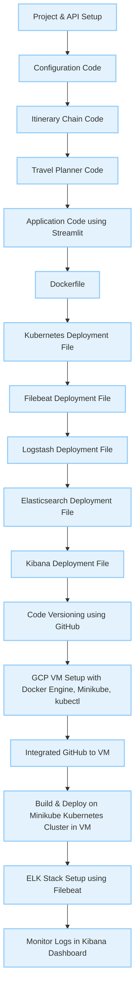

# 🧭 AI Travel Planner — LLMOps-Based Project

This project is a full-stack **AI Travel Planner** built using modern **LLMOps architectures**. It leverages powerful tools such as **LangChain**, **Streamlit**, **Docker**, **Kubernetes**, **Minikube**, **ELK Stack (Filebeat, Logstash, Elasticsearch, Kibana)**, and **GitHub Actions** for CI/CD to build, deploy, monitor, and maintain a scalable and intelligent travel planning assistant.

---

## 📌 Architecture Overview

This project follows a modular LLMOps pipeline covering:

- **LLM orchestration** with LangChain
- **Frontend interface** using Streamlit
- **Containerization & orchestration** using Docker + Kubernetes + Minikube
- **LLMOps pipeline automation** via GitHub & CI/CD
- **Observability & Monitoring** with ELK Stack

---

## 🔧 Core Functional Modules

| Tool          | Purpose                               | Usage in Travel Planner                                   |
|---------------|----------------------------------------|------------------------------------------------------------|
| **LangChain** | LLM orchestration & agent routing      | Connects GPT APIs with memory, tool use, and planning flow |
| **Streamlit** | Frontend UI/UX layer                   | Interactive interface for user queries and itinerary output |

---

## 📦 Infrastructure & Containerization

| Tool           | Purpose                              | Usage                                                     |
|----------------|---------------------------------------|------------------------------------------------------------|
| **Docker**     | Containerization                      | Packages app components for isolated environments          |
| **Minikube**   | Local Kubernetes cluster              | Simulates full infra locally before cloud deployment       |
| **Kubernetes** | Production-grade orchestration        | Manages scalable microservices, agents, vector DBs, etc.   |

---

## 🔁 LLMOps Pipeline & CI/CD

| Tool         | Purpose                                   | Usage                                                         |
|--------------|--------------------------------------------|----------------------------------------------------------------|
| **CPL**      | Custom pipeline logic for CI/CD           | Automates builds, LangChain agent updates, model rollouts     |
| **GitHub**   | Version control + collaboration platform  | Source code control, GitHub Actions for CI/CD                 |

---

## 📊 Observability & Monitoring

| Tool            | Purpose                        | Usage in Travel Planner                                        |
|-----------------|-------------------------------|----------------------------------------------------------------|
| **Filebeat**    | Log shipping from containers   | Collects logs from LangChain, frontend, backend agents         |
| **Logstash**    | Log transformation             | Parses and enriches logs for structured insights               |
| **Elasticsearch** | Searchable log storage       | Indexes logs for querying system performance and failures      |
| **Kibana**      | Visualization dashboard        | Visualizes usage trends, LLM latency, and system health        |

---

## 🚀 End-to-End Use Case Mapping

| Component                      | Toolchain                         | Use Case Description                                            |
|-------------------------------|-----------------------------------|-----------------------------------------------------------------|
| **LLM-powered trip planner**  | LangChain + GPT + Docker          | Orchestrates bookings, map APIs, weather, and flight data       |
| **User interface**            | Streamlit + Docker + GitHub       | Provides a chatbot-like interface to interact with the system   |
| **Monitoring & Insights**     | Filebeat + Logstash + Kibana      | Tracks user activity, errors, and API performance               |
| **CI/CD automation**          | GitHub Actions + Docker + K8s     | Automates code builds, container pushes, and deployment         |

---


## 🧱 Modular Workflow Architecture

This project follows a **four-block architecture** that ensures structured development, scalable deployment, efficient versioning, and continuous monitoring. Each block in the pipeline connects downstream to the next, enabling a complete LLMOps lifecycle from code to cloud.

### 🔹 Block 1: Development

This stage sets up the core logic and interfaces of the application:

- **Project & API Setup** → Define the initial project environment and connect external APIs (e.g., Flights, Weather, Booking).
- **Configuration Code** → Configure environment variables, LangChain models, and credentials.
- **Itinerary Chain Code** → Develop LangChain agents for itinerary generation using LLM + tools.
- **Travel Planner Code** → Connect itinerary logic to input parsing, logic reasoning, and memory chaining.
- **Application Code using Streamlit** → Build the interactive user interface to receive input and show results.

⬇️ Output flows to → **Containerization & Deployment**

---

### 🔹 Block 2: Containerization & Deployment

This block ensures infrastructure automation and environment parity through containerization:

- **Dockerfile** → Containerizes the entire application (LangChain + Streamlit).
- **Kubernetes Deployment File** → Defines how to run the app container on a cluster.
- **Filebeat Deployment File** → Collects logs from the app container.
- **Logstash Deployment File** → Parses and transforms logs from Filebeat.
- **Elasticsearch Deployment File** → Stores and indexes logs.
- **Kibana Deployment File** → Visualizes logs in real time.

⬇️ Output flows to → **Version Control & Cloud Setup**

---

### 🔹 Block 3: Version Control & Cloud Setup

This block handles automation, versioning, and remote orchestration:

- **Code Versioning using GitHub** → Source control for app, agents, Docker, and K8s files.
- **GCP VM Setup (Docker Engine + Minikube + kubectl)** → Cloud compute instance to simulate Kubernetes deployment.
- **GitHub-to-VM Integration** → Enables CI/CD and remote automation via GitHub Actions or manual triggers.

⬇️ Output flows to → **Build, Deploy & Monitor**

---

### 🔹 Block 4: Build, Deploy & Monitor

Final stage for operationalizing the system:

- **Build & Deploy App on Minikube K8s Cluster in VM** → Launch all containers (Streamlit app, LLM agents, ELK stack).
- **ELK Stack Setup using Filebeat** → Collect logs from containers, enrich with Logstash, and store in Elasticsearch.
- **Monitor Logs in Kibana Dashboard** → Visualize system health, user interaction, LLM agent behavior, and errors.

---

### 🔁 Mermaid Diagram — Workflow Overview



---

### 🔄 LLMOps Lifecycle

```mermaid
flowchart LR
A[Developer Commits Code] --> B[GitHub Repo]
B --> C[GitHub Actions Build & Test]
C --> D[Docker Image Created]
D --> E[Kubernetes Deployment via Minikube]
E --> F[LangChain Inference Services Up]
F --> G[User Interacts via Streamlit UI]
G --> H[Logs Generated]
H --> I[Filebeat -> Logstash -> Elasticsearch]
I --> J[Kibana Dashboards Updated]
'''

---